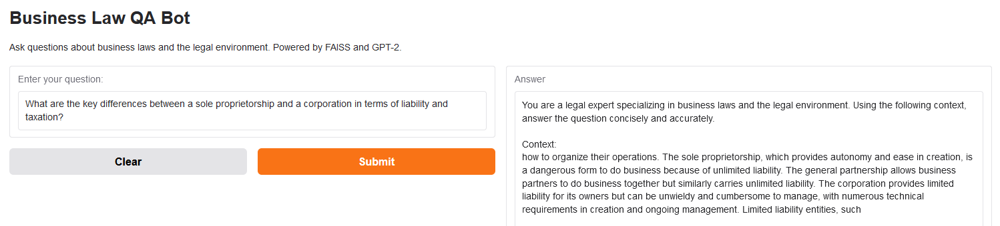
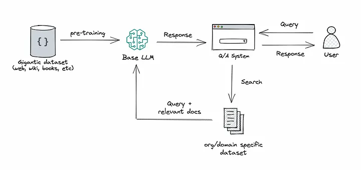

#  QA Bot: Business Law and Legal Environment

This application leverages retrieval-augmented generation (RAG) and large language models (LLMs) to answer questions about business laws and the legal environment. RAG combines a Facebook AI Similarity Search (FAISS)-based retrieval mechanism to fetch relevant document chunks with GPT-2, an LLM, to generate accurate and context-aware answers. This approach ensures responses are both grounded in reliable data and enhanced by the generative capabilities of advanced LLMs.

## Table of Contents
- [Introduction](#introduction)
- [Data](#data)
- [Methods](#methods)
- [Results](#results)
  - [Hugging Face Space](#hugging-face-space)
- [Directory Structure](#directory-structure)
- [Installation](#installation)
  - [Conda Environment Setup](#conda-environment-setup)
  - [Docker Setup (Optional)](#docker-setup-optional)
- [Usage](#usage)
  - [Run Main Script](#run-main-script)
  - [Run Each Source Script (Optional)](#run-each-source-script-optional)
    - [Data Preparation](#data-preparation)
    - [Building](#building)

## Introduction

This QA Bot leverages advanced machine learning and natural language processing (NLP) techniques to provide answers to questions about business laws and the legal environment. It employs a RAG approach, combining a FAISS vector store for efficient document retrieval with a free GPT-2 model via the Hugging Face API for response generation. The bot generates natural language answers grounded in the retrieved legal documents.

The goal of this project is to demonstrate how machine learning techniques can be applied to legal datasets to create an interactive question-answering tool.



## Data

The dataset consists of five textbooks related to business law and the legal environment. These textbooks were downloaded from https://open.umn.edu/opentextbooks/subjects/law. The content of these books has been preprocessed and embedded using FAISS for efficient document retrieval.
List of Textbooks:

> Mayer, D., Warner, D., Siedel, G., Lieberman, J., & Martina, A. (2012). Advanced Business Law and the Legal Environment. Saylor Foundation.

> Mayer, D., Warner, D., & Siedel, G. (2012). Business Law and the Legal Environment. Saylor Foundation.

> Mayer, D., Warner, D., Siedel, G., & Lieberman, J. (2012). Foundations of Business Law and Legal Environment. Saylor Foundation.

> Mayer, D., Warner, D., Siedel, G., & Lieberman, J. (2012). Government Regulation and the Legal Environment of Business. Saylor Foundation.

> Lau, T., & Johnson, L. (2011). The Legal and Ethical Environment of Business. Saylor Foundation.

These textbooks were adapted by The Saylor Foundation under a Creative Commons Attribution-NonCommercial-ShareAlike 3.0 License. For more information, visit [the law textbook list on the University of Minnesota's Open Textbook Library](https://open.umn.edu/opentextbooks/subjects/law).

## Methods

The application uses the following methods:
- **Document Embedding**: Legal texts are embedded using `sentence-transformers/all-MiniLM-L6-v2` to create a FAISS index for efficient similarity search.
- **RAG**: Combines document retrieval with generation by using the FAISS index to retrieve relevant chunks and providing them as context to the model, enhancing accuracy and relevance.
- **Response Generation by LLM**: GPT-2 generates answers grounded in retrieved document context using its transformer architecture for coherence and fluency.

The workflow ensures that the bot delivers reliable responses derived from credible sources.



*Figure from [What is a RAG and why you should use it in combination with your LLM by Gianluca Centulani](https://medium.com/@gcentulani/what-is-a-rag-and-why-you-should-use-it-in-combination-with-your-llm-78200d180753).*

> Lewis, P., Perez, E., Piktus, A., Petroni, F., Karpukhin, V., Goyal, N., & others. (2020). Retrieval-Augmented Generation for Knowledge-Intensive NLP Tasks. NeurIPS.  
  [Paper link](https://arxiv.org/abs/2005.11401)

> Radford, A., Wu, J., Child, R., Luan, D., Amodei, D., & Sutskever, I. (2019). Language Models are Unsupervised Multitask Learners. OpenAI.  
  [Paper link](https://cdn.openai.com/better-language-models/language_models_are_unsupervised_multitask_learners.pdf)

## Results

### Hugging Face Space

The application is deployed on Hugging Face Spaces. You can test the bot [here](https://huggingface.co/spaces/your-ai-solution/qa-bot-business-law-environment).

While the QA bot effectively retrieves and generates answers based on the provided textbooks, its responses are constrained by the accuracy and comprehensiveness of the source material. Additionally, the use of free GPT-2 for generation may result in less nuanced or detailed answers compared to more advanced language models.

## Directory Structure

```
qa-bot-business-law-environment/
├── app.png                         # Screenshot of the Hugging Face space
├── configs/                        # Configurations
│   └── huggingface_api_key.txt     # API key for Hugging Face (not uploaded for security)
├── data/                           # Dataset
│   ├── preprocessed/               # FAISS index files
│   └── raw/                        # Raw documents
├── Dockerfile                      # Docker setup
├── environment.yml                 # Conda environment setup
├── LICENSE                         # Project license
├── llm_rag.png                     # Illustration of an LLM integrated with RAG
├── main.py                         # Main pipeline script
├── README.md                       # Project README
├── requirements.txt                # Python dependencies
└── src/                            # Source code
    ├── data.py                     # Script for data preparation and FAISS indexing
    └── build.py                    # Script for retrieving and answering queries
```

## Installation

### Conda Environment Setup

1. Clone the repository:
   ```bash
   git clone https://github.com/your-ai-solution/qa-bot-business-law-environment.git
   cd qa-bot-business-law-environment
   ```

2. Create a Conda environment:
   ```bash
   conda env create -f environment.yml
   conda activate qa-bot-business-law-environment
   ```

3. Install dependencies:
   ```bash
   pip install -r requirements.txt
   ```

### Docker Setup (Optional)

1. Build the Docker image:
   ```bash
   docker build -t qa-bot-business-law-environment .
   ```

2. Run the Docker container:
   ```bash
   docker run --gpus all -v $(pwd)/data:/app/data -v $(pwd)/results:/app/results qa-bot-business-law-environment
   ```

##  Usage

### Run Main Script

1. Place [the downloaded textbook PDFs](https://open.umn.edu/opentextbooks/subjects/law) in `data/raw/`. 

2. Run the main script that automates the pipeline:
   ```bash
   python main.py
   ```

### Run Each Source Script (Optional)

1. Data preparation: Preprocess documents and create FAISS embeddings.
   ```bash
   python src/data.py
   ```

2. Building: Test document retrieval and response generation.
   ```bash
   python src/build.py
   ```